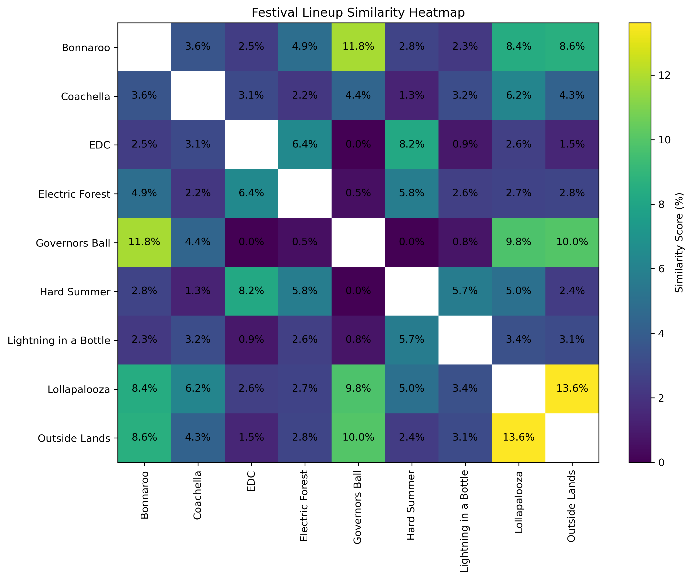

# Festival Lineup Similarity and Artist Network Analysis

A Python project that analyzes music festival lineup similarity and builds an artist network to explore how artists connect across the festival landscape.

## Project Overview

I started this project because my friends and I are always comparing festival lineups and trying to decide which events are actually worth going to. I noticed how much overlap there can be between music festival lineups, which I wanted to explore further.

I approached this in two ways. First, I compared how similar festivals are to one another based on shared artists. Second, I built an artist appearance network to see how the festival ecosystem is connected.

I wanted the network to show which artists are most important for connecting different festivals, whether distinct clusters form, and what might explain those clusters.

## Research Questions

1. How similar are music festivals based on their artist lineups?

2. Which artists connect different festivals and scenes?

3. What groups or clusters form in the artist network, and what might explain those patterns?

4. How can this network structure serve as a foundation for future artist growth analysis?

## Data

The dataset contains lineup data from 9 music festivals, with over 900 unique artists and over 1,000 artist appearances. I manually collected the artist names from each festival lineup and entered them into a spreadsheet.

I cleaned the artist names by removing extra spaces and formatting issues, then created a separate cleaned artist name column to standardize names across festivals and better match how artists appear on Spotify.

For collaborative sets, such as B2B sets or names listed with “w/” or “and,” I split the artists into separate rows when appropriate.

Each row represents one artist appearance at one festival.

## Methodology

### Artist Network Construction

I first grouped artists by festival and created every combination of artist pairs within each festival lineup. I then counted how many times each artist pair appeared together across the 9 festivals.

These counts became the connection weights in the network, meaning that artist pairs who appeared together at multiple festivals had stronger connections.

In the network, each node represents an artist and each connection represents artists appearing at the same festival. I used weighted degree to measure how connected each artist was across the network, with larger nodes representing artists with more overall connections.

I also used betweenness centrality to identify bridge artists, or artists that help connect different scenes, clusters, or festivals within the network.

### Festival Similarity Analysis

For the festival similarity analysis, I grouped artists by festival and turned each festival lineup into a set of unique artist names.

I then compared every pair of festivals using intersection and union. Intersection identified the artists shared by both festivals, while union identified the total unique artists across the two lineups.

I used these values to calculate a lineup similarity score by dividing the number of shared artists by the total number of unique artists. This allowed me to rank which festivals had the most lineup overlap.

## Outputs and Visualizations

The artist network analysis produced an artist network CSV with every artist pairing and the number of times each pair appeared together across festivals.

It also produced a weighted degree artist CSV showing total connection weight for each artist, and a bridge artist CSV showing betweenness centrality, number of festivals, and festival names for each artist.

The artist network was visualized using three minimum coappearance thresholds: 2, 3, and 4. These versions helped compare how the network changes when weaker connections are filtered out.

The festival similarity analysis produced a festival similarity CSV showing each festival pairing, shared artists, total unique artists, and similarity score.

I also created a festival similarity heatmap to show lineup overlap across all festival pairs.

### Artist Network, Minimum Coappearance Threshold of 3

.png)

### Festival Similarity Heatmap



## Initial Findings

The artist network formed visible clusters, especially when filtering to artist pairs that appeared together at least two times. These clusters seemed to reflect festival level grouping and possible similarities in lineup style.

A minimum coappearance threshold of 2 preserved more of the network, but it was harder to interpret visually because there were too many connections. A threshold of 3 provided the clearest balance between network structure and readability, so I used it as the main network view.

The top bridge artists by betweenness centrality included Fcukers, Tape B, and Interplanetary Criminal. These artists appeared across multiple festivals and helped connect different parts of the network.

The festival similarity analysis showed that some festival pairs had noticeably higher lineup overlap than others. The most similar pairs were Lollapalooza and Outside Lands, Bonnaroo and Governors Ball, and Governors Ball and Outside Lands.

The festival similarity analysis helped identify direct lineup overlap between festivals, while the artist network showed how those overlaps contributed to the larger festival ecosystem.

The number of festivals an artist appeared at seemed to be one of the biggest factors affecting betweenness centrality. Artists who appeared across multiple festivals, especially festivals with broader or more varied lineups, were more likely to act as bridge artists.

## Limitations

This project should be viewed as a version 1 exploratory analysis. The current dataset includes 9 U.S. music festivals from the 2025 summer festival season, so it does not represent the full festival ecosystem. It also does not include festivals my friends and I were not considering, or international festivals.

The project does not currently include genre data. Because of that, I can observe clusters in the artist network, but I cannot fully confirm whether those clusters are being driven by genre, festival type, or another factor.

I was not able to track artist growth metrics in this version. Spotify’s API does not provide historical popularity data through a simple lookup, so popularity or follower growth would need to be collected through snapshots over time.

Network centrality should not be interpreted as the same thing as artist popularity. A very popular artist may only headline one or two festivals, while a less mainstream artist may appear across several festivals and have a stronger network position in this dataset.

## Future Work

Future work for this project includes building a follow up version that addresses many of the current limitations.

I plan to expand the dataset to include more festivals across different genres, locations, and countries. By choosing the festivals ahead of time, I can manually collect Spotify popularity and follower data at set time points before and after each event to better track artist growth.

I also plan to collect genre data through the Spotify API to better understand whether network clusters are related to genre, festival type, or location.

## Tools Used

This project used Google Sheets to manually build the initial festival lineup dataset. I also used pivot tables to organize the raw lineup data and create usable CSV files for analysis.

The analysis was completed in Python using pandas, NumPy, NetworkX, and Matplotlib. I wrote the code in Jupyter Notebook because it made it easier to build, test, and debug the project step by step.
```
